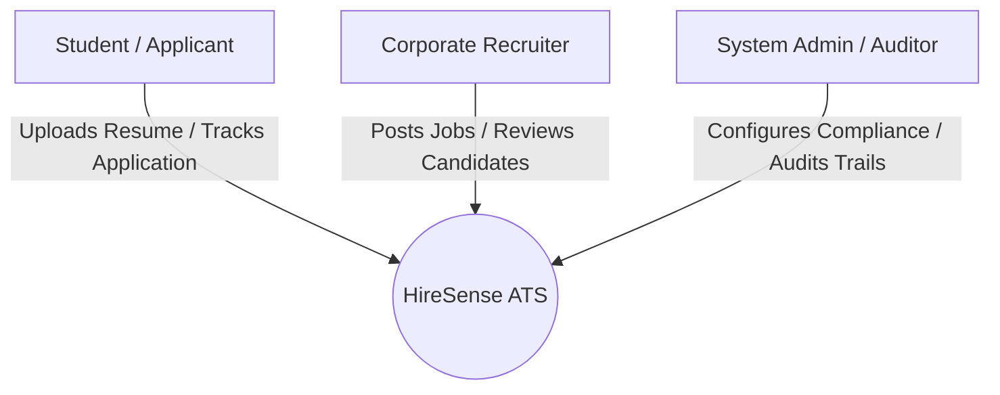
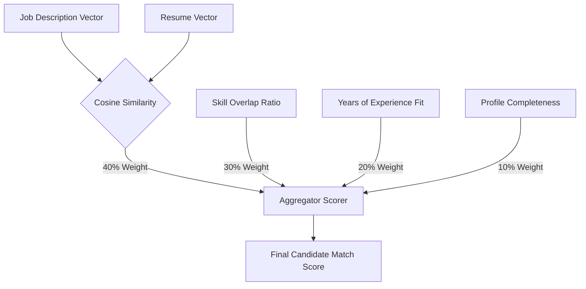

# Product Requirement Document (PRD)

## Project: HireSense (AI-Powered Applicant Tracking System)
**Document Status**: Proposal  
**Target Launch Date**: Q3 2026  
**Author**: Antigravity Product Architect  
**Version**: 1.0.0  

---

## 📖 1. Executive Summary

### 1.1 Product Vision
**HireSense** is a next-generation, AI-first Applicant Tracking System (ATS) designed to bridge the gap between corporate recruiters and student candidates. By leveraging semantic vector search, heuristic scoring, and real-time synchronization, HireSense automates resume screening, grades candidates against dynamic job descriptions (JDs) with explainable AI scores, and provides a beautiful, cinematic, and responsive interface for both recruiters and applicants.

### 1.2 The Problem Statement
*   **Recruiter Fatigue**: Corporate recruiters spend an average of 6–8 seconds scanning a single resume, leading to missed talent and high fatigue.
*   **Keyword Stuffing**: Legacy ATS platforms rely on simple exact-match keyword indexing, which candidates exploit through "keyword stuffing," while high-potential candidates who use synonyms are filtered out.
*   **System Latency in AI Parsing**: Modern Large Language Models (LLMs) provide deep analytical parsing but suffer from high latency and rate-limiting bottlenecks, making real-time interactive screening sluggish.
*   **Lack of Candidate Transparency**: Students apply to job listings and enter a "black hole" of recruitment with zero visibility into their application state, matching criteria, or parsing progress.

### 1.3 Target Audience
1.  **Corporate Recruiters & Hiring Managers**: Seeking to screen, filter, evaluate, and manage candidate pipelines efficiently without manual skimming.
2.  **Student Candidates**: Seeking a streamlined application process, automatic profile generation from resume uploads, and transparent real-time application tracking.
3.  **HR Compliance Auditors**: Requiring explainable AI metrics to verify non-biased employment decision-making under modern legal standards.

---

## 👥 2. User Personas



### 2.1 Sarah (The High-Volume Campus Recruiter)
*   **Objectives**: Filter 500+ student applications for a single Software Engineering Internship within minutes.
*   **Frustrations**: Sifting through poorly formatted student resumes; copy-pasting candidate summaries; dealing with slow, clunky corporate ATS UIs.
*   **Needs**: Explainable candidate scores, direct semantic matching, keyword density analysis, and an interactive, real-time pipeline dashboard.

### 2.2 Alex (The Graduating Student Applicant)
*   **Objectives**: Upload their resume, apply to multiple relevant internships, and get transparent status updates.
*   **Frustrations**: Retyping their work experience into form fields after uploading a PDF; never hearing back from employers.
*   **Needs**: Fast, error-free resume parsing, instant profile auto-population, and a real-time status tracker.

### 2.3 Marcus (The IT Administrator & Compliance Officer)
*   **Objectives**: Ensure the platform complies with local regulations (such as NYC Local Law 144 on Automated Employment Decision Tools) and secure corporate secrets.
*   **Frustrations**: Unexplainable black-box AI scores that expose the company to legal liability.
*   **Needs**: Detailed audits, RLS logical isolation, and an "AI Bias Compliance" switch (Fair Mode).

---

## ⚙️ 3. Core Product Features & Functional Requirements

### 3.1 Feature Group 1: Candidate Portal (Student Facing)

#### 3.1.1 PDF Resume Parsing & Profile Auto-Creation
*   **Description**: Students upload a PDF resume. The system extracts the text, passes it to the AI parser, and populates the student profile form automatically.
*   **Requirements**:
    *   Support file uploads up to 10MB (PDF/DOCX).
    *   Convert PDF to clean text via background extraction utilities.
    *   Automatically extract: Full Name, Email, Contact Number, Top 10 Skills, Years of Experience, Education History, and Work Experience.
    *   Save raw text and file URL to the Supabase database.

#### 3.1.2 Unified Application Hub
*   **Description**: A personal dashboard showing the student’s active applications, matching scores (optional visibility), and real-time status tracker (Pending ➜ Screened ➜ Interviewing ➜ Approved/Rejected).
*   **Requirements**:
    *   Sub-second UI state updates powered by Supabase Realtime WebSocket listeners.

---

### 3.2 Feature Group 2: Recruiter Workspace (Recruiter Facing)

#### 3.2.1 Interactive Pipeline & Dashboard
*   **Description**: A drag-and-drop or status-click Kanban/column layout showing candidate cards sorted by matching scores.
*   **Requirements**:
    *   Cinematic dark/light mode interface with fluid transitions.
    *   Ability to change a candidate's state with a single click, instantly syncing across all connected recruiters.
    *   Search and filter capability based on Name, Keywords, or Min Score.

#### 3.2.2 Dynamic Job Description Creator
*   **Description**: A form enabling recruiters to create job postings with specific title, requirements, skills, and weightings.
*   **Requirements**:
    *   Automatically trigger semantic embedding calculation (`VECTOR(384)`) for the job description text upon creation.

---

### 3.3 Feature Group 3: Core AI & Evaluation Engine



#### 3.3.1 Multidimensional Matching Algorithm
*   **Description**: A robust scoring system combining four metrics to calculate an overall fit score (0 - 100%).
*   **The Weighting Formula**:
    1.  **Semantic Score (40%)**: Cosine similarity between dense Sentence-Transformer embedding vectors (`all-MiniLM-L6-v2`) of the JD and the Resume.
    2.  **Skill Score (30%)**: Taxonomy matching ratio of required skills vs. candidate skills.
    3.  **Experience Fit (20%)**: Algorithm determining whether candidate's years of experience matches the JD requirements.
    4.  **Resume Strength (10%)**: Profile completeness metric based on formatting, text density, and numeric content.

#### 3.3.2 "Fair Mode" AI Compliance Mode
*   **Description**: A toggle on the matching engine that skips direct years-of-experience weighting to remove screening bias for junior or student roles.
*   **Weighting Shift**: When Fair Mode is enabled, weights automatically shift to:
    *   Semantic Score: **55%**
    *   Skill Score: **35%**
    *   Resume Strength: **10%**
    *   Experience Score: **0% (Disabled)**

#### 3.3.3 Multi-Model NVIDIA NIM Racing Engine
*   **Description**: An ultra-low latency inference engine that queries multiple LLMs concurrently and selects the fastest valid response.
*   **Technical Details**:
    *   Concurrently queries `Llama-3.1-8B`, `Llama-3.2-3B`, and `Llama-3.2-1B` in parallel using async API calls.
    *   Automatically parses and validates the returned JSON. The fastest valid returning model wins the race.
    *   Includes in-memory prompt hashing cache to prevent redundant API queries.
    *   Employs heuristic local fallback engine in the event of complete API network failure.

---

## 🗄️ 4. Technical Architecture & Database Design

### 4.1 Technology Stack
*   **Frontend**: React (v19), Vite, Tailwind CSS, Vanilla CSS Variable Themes (Sleek Dark/Light Modes).
*   **Backend**: FastAPI (Python 3.11+), Uvicorn server, Pydantic data schemas.
*   **Database**: Supabase (PostgreSQL) + `pgvector` extension for similarity queries.
*   **AI Inference**: NVIDIA NIM API Gateway, HuggingFace Serverless Inference.

### 4.2 Core Logical Database Entities

#### Table: `resumes`
```sql
CREATE TABLE resumes (
    id UUID PRIMARY KEY DEFAULT gen_random_uuid(),
    user_id TEXT NOT NULL, -- Links to Supabase Auth user
    candidate_name VARCHAR(255) NOT NULL,
    raw_text TEXT NOT NULL,
    file_url TEXT,
    embedding VECTOR(384), -- Dense semantic vectors
    ats_score FLOAT DEFAULT 0,
    ats_breakdown JSONB, -- Heuristic formatting suggestions
    status VARCHAR(50) DEFAULT 'Pending',
    created_at TIMESTAMP WITH TIME ZONE DEFAULT timezone('utc'::text, now()) NOT NULL,
    updated_at TIMESTAMP WITH TIME ZONE DEFAULT timezone('utc'::text, now()) NOT NULL,
    deleted_at TIMESTAMP WITH TIME ZONE
);
```

#### Table: `job_descriptions`
```sql
CREATE TABLE job_descriptions (
    id UUID PRIMARY KEY DEFAULT gen_random_uuid(),
    user_id TEXT NOT NULL,
    title VARCHAR(255) NOT NULL,
    job_text TEXT NOT NULL,
    embedding VECTOR(384),
    created_at TIMESTAMP WITH TIME ZONE DEFAULT timezone('utc'::text, now()) NOT NULL,
    updated_at TIMESTAMP WITH TIME ZONE DEFAULT timezone('utc'::text, now()) NOT NULL,
    deleted_at TIMESTAMP WITH TIME ZONE
);
```

#### Table: `match_results`
```sql
CREATE TABLE match_results (
    id UUID PRIMARY KEY DEFAULT gen_random_uuid(),
    user_id TEXT NOT NULL,
    resume_id UUID REFERENCES resumes(id) ON DELETE CASCADE,
    job_id UUID REFERENCES job_descriptions(id) ON DELETE CASCADE,
    semantic_score FLOAT DEFAULT 0,
    skill_score FLOAT DEFAULT 0,
    experience_score FLOAT DEFAULT 0,
    final_score FLOAT DEFAULT 0,
    fair_mode_enabled BOOLEAN DEFAULT FALSE,
    bias_report JSONB,
    candidate_status VARCHAR(50) DEFAULT 'Pending',
    created_at TIMESTAMP WITH TIME ZONE DEFAULT timezone('utc'::text, now()) NOT NULL,
    updated_at TIMESTAMP WITH TIME ZONE DEFAULT timezone('utc'::text, now()) NOT NULL,
    deleted_at TIMESTAMP WITH TIME ZONE
);
```

---

## 🔒 5. Non-Functional Requirements

### 5.1 Security & Compliance
*   **Data Isolation**: Strict logical scoping at the API endpoint level—all operations filter queries using the authenticated `user_id`.
*   **Request Size Control**: Middleware must drop payloads exceeding 10MB to block network flooding attacks.
*   **Path Traversal Protection**: Sanitize all raw candidate filenames before fetching or downloading to block path injection attempts.

### 5.2 Performance & Scalability
*   **Vector Query Speeds**: Implement B-Tree indexes on text fields and HNSW indexes on vector columns to ensure matching execution takes `< 500ms` for collections up to 50,000 resumes.
*   **Backend Concurrency**: Route database traffic via the **Supavisor Transaction Pooler (Port 6543)** to handle up to 10,000 active web connections without database crash limits.
*   **Background Offloading**: Heavily block-prone AI requests must run as asynchronous backend tasks, ensuring user API responses complete within `< 200ms`.

### 5.3 Reliability & Availability
*   **99.9% Uptime Goal**: Utilize redundant server instances and resilient API caching.
*   **Disaster Recovery**: Automated daily backup pipeline exporting PostgreSQL data directly to **Cloudflare R2** with a 30-day retention rule.

---

## 🚀 6. Future Roadmap (Enterprise Scale Upgrades)

*   **Multi-Tenant Teams**: Enable workspace collaboration where multiple recruiters from the same company can share pipelines, add candidate notes, and vote on candidates.
*   **Calendar Auto-Booking**: Synchronize with Microsoft Outlook and Google Workspace to generate Calendly-style booking slots and Google Meet coordinates.
*   **ATS Two-Way Sync**: Integrate with enterprise HR systems (like Greenhouse, Workday, and Lever) to import active jobs and export matched candidates directly.
*   **AIC Bias Dashboard**: Auditing reports calculating demographic impact ratios to satisfy international artificial intelligence compliance laws.
